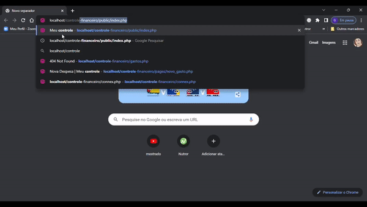

# Controle financeiro
Controle dos gastos pessoais, mostrando os gastos mensais, vencimento e parcelas, 
como também, o valor total de todos os meses em aberto, para que desta forma o  
usuário possa se programar melhor com os futuros gastos.

  

## Objetivo
O objetivo deste sistema foi aprender e por em prática a conexão ao banco de dados 
e a linguagem PHP.

## Tecnologias utilizadas
- php;
- html;
- sql(mysql)

## Considerações finais
Este projeto está em fase inicial, onde a primeira etapa foi concluida, restando um bug  
de indefinição do index, que será corrigida. 
Breve será implementado o css para ficar com uma aparência mais amigável, porém o foco 
inicial é focar no php e sql.
